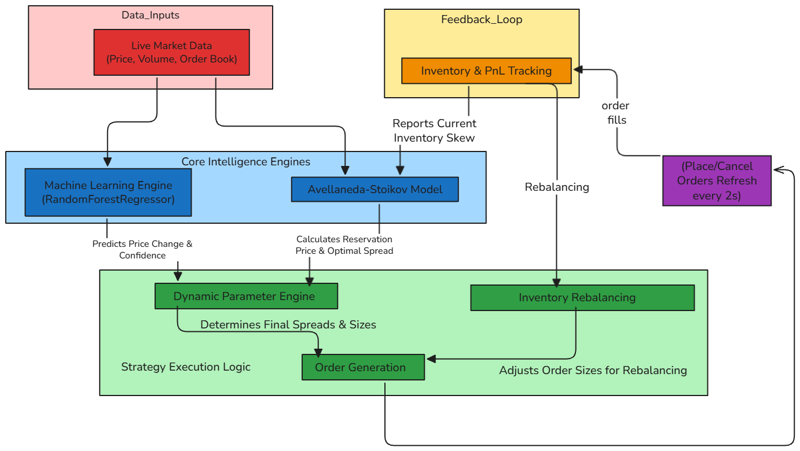

# Dynamic ML Market Making Strategy

## Overview

My Dynamic ML Market Making strategy is an advanced Hummingbot algorithm that optimizes bid-ask spreads and order sizes in real-time. It merges machine learning, financial theory, and inventory management to maximize profits while managing risks—perfect for liquid markets.
### Key Features

    - Machine Learning Predictions: Random Forest regressor forecasts price movements from historical data  - (returns, volatility, volume momentum).
    - Avellaneda-Stoikov Model: Sets optimal spreads with risk in mind.
    - Dynamic Spread Adjustments: Adapts to volatility, volume, and inventory skew.
    - Ultra-Tight Spreads: Starts at 1-3 basis points for high volume.
    Fast Order Refreshes: Updates every 2 seconds for responsiveness.

### Decision-Making Process

    Data Collection: Pulls real-time market and inventory info.
    Feature Engineering: Extracts indicators (returns, volatility, volume).
    ML Predictions: Predicts price changes and confidence.
    Theoretical Spreads: Uses Avellaneda-Stoikov for base spreads.
    Blending: Combines ML and theoretical adjustments.
    Inventory Management: Tweaks spreads/order sizes by skew.
    Risk Controls: Adjusts for volatility.
    Order Placement: Sets bid/ask prices and sizes.

### Benefits

    Adaptability: Handles market shifts on the fly.
    Risk Management: Balances profit with safety.
    Innovation: Fuses ML and finance for a fresh approach.

This project showcases my ability to build smart, practical solutions—ideal for an internship where innovation matters.
